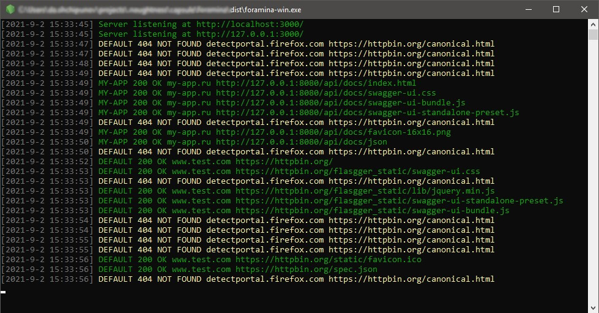
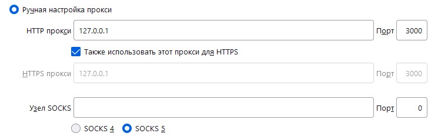

# FORAMINA



## Когда нужно прокинуть ваш сервис в интернет

`foramina` представляет собой настраиваемый прокси сервер с интеграцией [ngrok](https://ngrok.com),
поддержкой `websocket` и возможностью определять набор правил для преобразования совпадающих маршрутов в целевые, с
которыми прокси будет разговаривать от имени клиента.

В процессе разработки бывают ситуации, когда вам необходимо показать результат другому человеку. Самое первое, что
приходит на ум — это купить дешевый хост и развернуть там, но это дополнительные затраты денег и времени. Другой пример
— когда вы делаете свой локальный проект и вам нужно получать запросы от внешних сервисов.

Для данных случаев вы можете воспользоваться сервисами создания туннелей. Одним из популярных сервисов для построения
туннелей до вашего компьютера является [ngrok](https://ngrok.com). Он безумно простой и одновременно функциональный в
бесплатной версии.

Но бывают ситуации когда необходимо настроить правила переадресации, либо объединить работу внутренних сервисов компании
и локального проекта для демонстрации заказчику. Возможно вам так же необходимо отладить мобильное приложение которому
необходим доступ к закрытому API. В таких ситуациях незаменимым помощником будет `foramina`.

## Как работать с `foramina`

### Упакованный скрипт без зависимостей

- скачать [последний релиз](https://github.com/goodvir/foramina/releases/latest)
- удостовериться, что ваши локальные сервисы запущены и ожидают HTTP запросов
- настроить [файл конфигурации](#настройка-конфигурации) `foramina`
- запустить [исполняемый файл](#исполняемые-файлы)

### Сборка из исходного кода

- [клонировать репозиторий](https://github.com/goodvir/foramina.git)
  или [скачать архив](https://github.com/goodvir/foramina/archive/refs/heads/master.zip)
- установить зависимости `npm i`
- настроить [файл конфигурации](#настройка-конфигурации) `foramina`
- выполнить необходимую команду:
  - `npm run dev` - запуск в режиме разработки
  - `npm run start` - запуск в стандартном режиме
  - `npm run build` - [компиляция исполняемых файлов](#исполняемые-файлы)

## Настройка конфигурации

Во время запуска скрипт проверяет наличие файла конфигурации `./config.yml`, если он отсутствует, создает новый с
шаблоном настроек.

Для запуска туннеля [ngrok](https://ngrok.com) необходимы бинарные файлы которые будут созданы в папке `./bin` при
первом запуске скрипта.

Различные варианты конфигурации можно посмотреть в разделе с [примерами](#примеры-конфигурации).

По умолчанию для всех запросов которые не попадают под правила маршрутизации сервер генерирует пустой ответ с HTTP
кодом `444`, это поведение можно изменить на режим обратного прокси, установив параметр `revers: true`.

### Поддерживаемые параметры

- `host` _string_: интерфейс, который будет прослушивать сервер, по умолчанию прослушивается только _127.0.0.1_
  интерфейс _localhost_, чтобы прослушивать все доступные интерфейсы IPv4, следует указать _0.0.0.0_
- `port` _number_: порт, который будет прослушивать сервер, _default: 3000_
- `revers` _boolean_: режим обратного прокси, _default: false_
- `logs` _string|object_: [формат строки журнала](#логирование) логирования, либо объект с расширенными параметрами
  - `format` _string_: [формат строки журнала](#логирование) логирования
  - `file` _boolean_: флаг дублирования журнала логирования в файл _./foramina.log_
- `proxy` _object_: объект с параметрами доступными
  для [node-http-proxy](https://github.com/http-party/node-http-proxy#options), данные параметры применяются для всех
  соединений
- `ngrok` _object_: объект с параметрами доступными для [ngrok](https://github.com/bubenshchykov/ngrok#options), данные
  параметры применяются для всех созданных туннелей
- `routing` _array_: список данных для маршрутизации входящих соединений и создания туннелей
  - `active` _boolean_: флаг использования данных при формировании правил маршрутизации
  - `name` _string_: псевдоним настроек для отображения в журнале логирования
  - `opts` _object_: объект с параметрами доступными
    для [node-http-proxy](https://github.com/http-party/node-http-proxy#options), данные параметры применяются для
    текущего правила маршрутизации
  - `forward` _string|array_: имя хоста (либо список имен) для привязки правил маршрутизации, например _app.ru_, так же
    допустимо использовать _any_ для настройки правил по умолчанию
  - `target` _string|object_: целевой URL для перенаправления, например _https://github.com_, так же возможно указать
    объект с параметрами доступными для [http-proxy-rules](https://github.com/donasaur/http-proxy-rules#options),
    смотрите [доступные примеры](https://github.com/donasaur/http-proxy-rules/blob/master/test/index.tests.js#L33)
  - `tunnel` _boolean|object_: параметры туннеля [ngrok](https://ngrok.com) возможно указывать _true/false_
    - `active` _boolean_: флаг необходимости создания туннеля
    - `opts` _object_: объект с параметрами доступными для [ngrok](https://github.com/bubenshchykov/ngrok#options)

### Примеры конфигурации

**Проксирование всех запросов `http://127.0.0.1:3000` на `http://127.0.0.1:8080`**

```yaml
routing:
  - active: true
    name: DEFAULT
    forward: any # Применять правила для всех запросов
    target: http://127.0.0.1:8080
```

```text
Server listening at http://localhost:3000/
Server listening at http://127.0.0.1:3000/
DEFAULT 127.0.0.1 200 OK GET http://127.0.0.1:3000/ http://127.0.0.1:8080/
DEFAULT 127.0.0.1 200 OK GET http://localhost:3000/ http://127.0.0.1:8080/
DEFAULT 127.0.0.1 404 Not Found GET http://127.0.0.1:3000/test http://127.0.0.1:8080/test
DEFAULT 127.0.0.1 404 Not Found GET http://localhost:3000/test http://127.0.0.1:8080/test
```

**Использование правил маршрутизации и дополнительных настроек сервера**

```yaml
proxy:
  secure: false # Отключить проверку SSL
routing:
  - active: true
    name: DEFAULT
    forward: any # Применять правило для всех запросов
    target:
      default: http://127.0.0.1:8080
      rules:
        # Перенаправить /anything на внешний сервис https://httpbin.org
        "/anything": https://httpbin.org/anything
```

```text
DEFAULT 127.0.0.1 200 OK GET http://127.0.0.1:3000/ http://127.0.0.1:8080/
DEFAULT 127.0.0.1 200 OK GET http://127.0.0.1:3000/anything https://httpbin.org/anything
```

**Прослушивание всех доступных интерфейсов `IPv4` на `9000` порту**

```yaml
host: 0.0.0.0
port: 9000
routing:
  - active: true
    name: DEFAULT
    forward: any # Применять правило для всех запросов
    target: http://127.0.0.1:8080
```

```text
Server listening at http://localhost:9000/
Server listening at http://127.0.0.1:9000/
Server listening at http://192.168.155.209:9000/
DEFAULT 127.0.0.1 200 OK GET http://localhost:9000/ http://127.0.0.1:8080/
DEFAULT 127.0.0.1 200 OK GET http://localhost:9000/favicon.ico http://127.0.0.1:8080/favicon.ico
DEFAULT 127.0.0.1 200 OK GET http://127.0.0.1:9000/ http://127.0.0.1:8080/
DEFAULT 192.168.155.209 200 OK GET http://192.168.155.209:9000/ http://127.0.0.1:8080/
DEFAULT 192.168.155.209 200 OK GET http://192.168.155.209:9000/favicon.ico http://127.0.0.1:8080/favicon.ico
```

**Использование совместно с браузером [Firefox](https://www.mozilla.org/ru)**

Необходимо настроить [параметры соединения браузера](https://support.mozilla.org/ru/kb/parametry-soedineniya-v-firefox)
на работу с прокси сервером:



```yaml
revers: true # Режим обратного прокси
proxy:
  ws: true
  xfwd: false
  secure: false
  changeOrigin: true
  autoRewrite: true
ngrok:
  region: us
routing:
  # Перенаправить запросы ya.ru 
  - active: true
    name: YANDEX
    forward: ya.ru
    target:
      default: https://httpbin.org
      rules:
        "/search/(.+)": https://httpbin.org/anything/files?search=$1
  # Перенаправить запросы my-app.ru и создать туннель ngrok
  - active: true
    name: MY-APP
    forward: my-app.ru
    target: http://127.0.0.1:8080
    tunnel: true
```

```text
Created tunnel MY-APP https://33ab3dd28e0c.ngrok.io/
Server listening at http://localhost:3000/
Server listening at http://127.0.0.1:3000/
YANDEX 127.0.0.1 200 OK GET http://ya.ru/ https://httpbin.org/
YANDEX 127.0.0.1 200 OK GET http://ya.ru/flasgger_static/swagger-ui-bundle.js https://httpbin.org/flasgger_static/swagger-ui-bundle.js
YANDEX 127.0.0.1 200 OK GET http://ya.ru/flasgger_static/swagger-ui-standalone-preset.js https://httpbin.org/flasgger_static/swagger-ui-standalone-preset.js
YANDEX 127.0.0.1 200 OK GET http://ya.ru/flasgger_static/lib/jquery.min.js https://httpbin.org/flasgger_static/lib/jquery.min.js
YANDEX 127.0.0.1 200 OK GET http://ya.ru/flasgger_static/swagger-ui.css https://httpbin.org/flasgger_static/swagger-ui.css
YANDEX 127.0.0.1 200 OK GET http://ya.ru/static/favicon.ico https://httpbin.org/static/favicon.ico
YANDEX 127.0.0.1 200 OK GET http://ya.ru/spec.json https://httpbin.org/spec.json
YANDEX 127.0.0.1 200 OK GET http://ya.ru/search/test https://httpbin.org/anything/files?search=test
MY-APP 127.0.0.1 200 OK GET http://my-app.ru/ http://127.0.0.1:8080/
MY-APP 127.0.0.1 200 OK GET http://my-app.ru/favicon.ico http://127.0.0.1:8080/favicon.ico
- 127.0.0.1 - PROXY CONNECT https://www.google.com/ https://www.google.com/
- 127.0.0.1 - PROXY CONNECT https://github.com/ https://github.com/
- 127.0.0.1 - PROXY CONNECT https://github.githubassets.com/ https://github.githubassets.com/
- 127.0.0.1 - PROXY CONNECT https://alive.github.com/ https://alive.github.com/
MY-APP 127.0.0.1 200 OK GET https://33ab3dd28e0c.ngrok.io/ http://127.0.0.1:8080/
MY-APP 127.0.0.1 200 OK GET https://33ab3dd28e0c.ngrok.io/favicon.ico http://127.0.0.1:8080/favicon.ico
```

**Генерируемый шаблон настроек при отсутствии пользовательской конфигурации**

```yaml
host: 127.0.0.1
port: 3000
revers: false
logs:
  format: '$name $ip $statusCode $statusMessage $method $forward_href $target_href'
  file: false
proxy:
  ws: true
  xfwd: false
  secure: false
  changeOrigin: true
  autoRewrite: true
ngrok:
  authtoken:
  region: us
routing:
  - active: true
    name: DEFAULT
    opts:
    forward: any
    target:
      default: https://httpbin.org
      rules:
    tunnel:
      active: false
      opts:
```

## Логирование

Для всех запросов `foramina` формирует запись, которая согласно шаблону строки журнала выводится в консоль, шаблоном
можно управлять через [параметры конфигурации](#поддерживаемые-параметры), так же можно включить дублирования журнала
логирования в файл _./foramina.log_

Формат строки журнала поддерживает следующие литералы:

- `$name` - псевдоним настроек
- `$ip` - IP источника запроса
- `$statusCode` - HTTP код ответа
- `$statusMessage` - краткая информация о статусе запроса
- `$method` - HTTP метод запроса
- `$forward_href` - источник запроса, [подробнее](https://url.spec.whatwg.org/#api)
- `$forward_origin` - источник запроса, [подробнее](https://url.spec.whatwg.org/#api)
- `$forward_host` - источник запроса, [подробнее](https://url.spec.whatwg.org/#api)
- `$forward_pathname` - источник запроса, [подробнее](https://url.spec.whatwg.org/#api)
- `$target_href` - перенаправления запроса, [подробнее](https://url.spec.whatwg.org/#api)
- `$target_origin` - перенаправления запроса, [подробнее](https://url.spec.whatwg.org/#api)
- `$target_host` - перенаправления запроса, [подробнее](https://url.spec.whatwg.org/#api)
- `$target_pathname` - перенаправления запроса, [подробнее](https://url.spec.whatwg.org/#api)

## Исполняемые файлы

- `foramina-macos` - node16-macos-x64
- `foramina-linux` - node16-linux-x64
- `foramina-win.exe` - node16-win-x64

## Как это работает?

- [node-http-proxy](https://github.com/http-party/node-http-proxy#readme)
- [http-proxy-rules](https://github.com/donasaur/http-proxy-rules#readme)
- [ngrok](https://github.com/bubenshchykov/ngrok#readme)
- [YAML](https://github.com/eemeli/yaml#readme)
- [pkg](https://github.com/vercel/pkg#readme)
